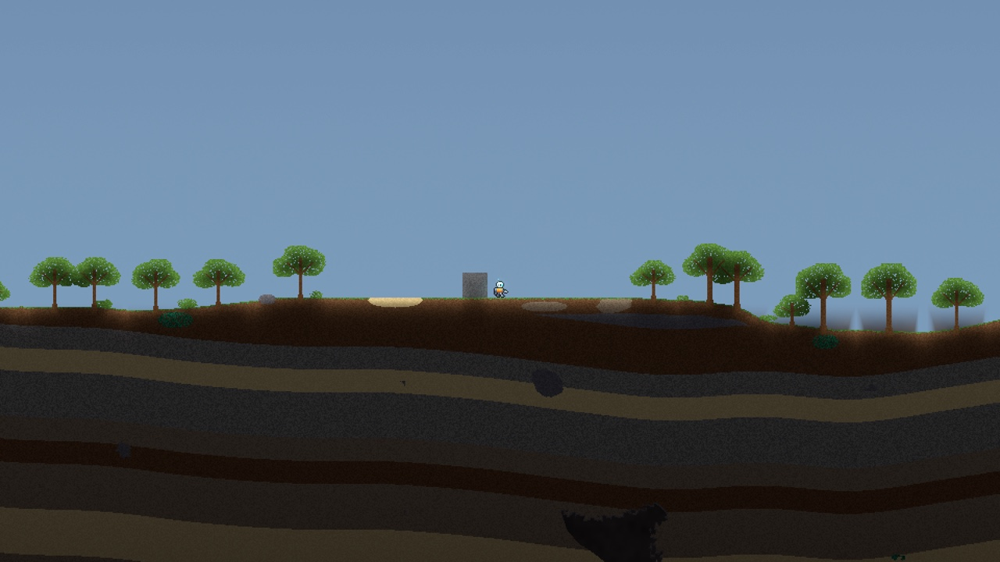
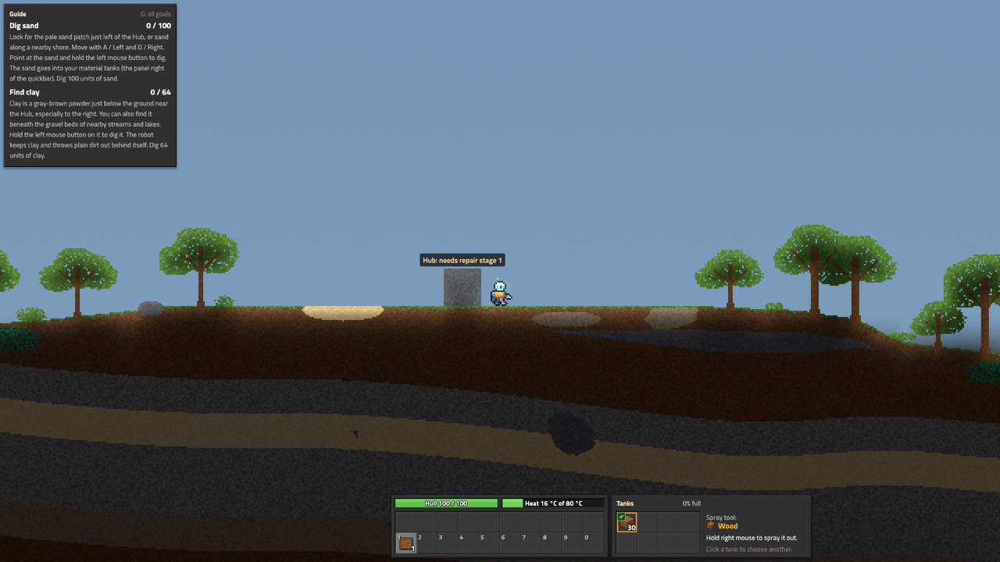
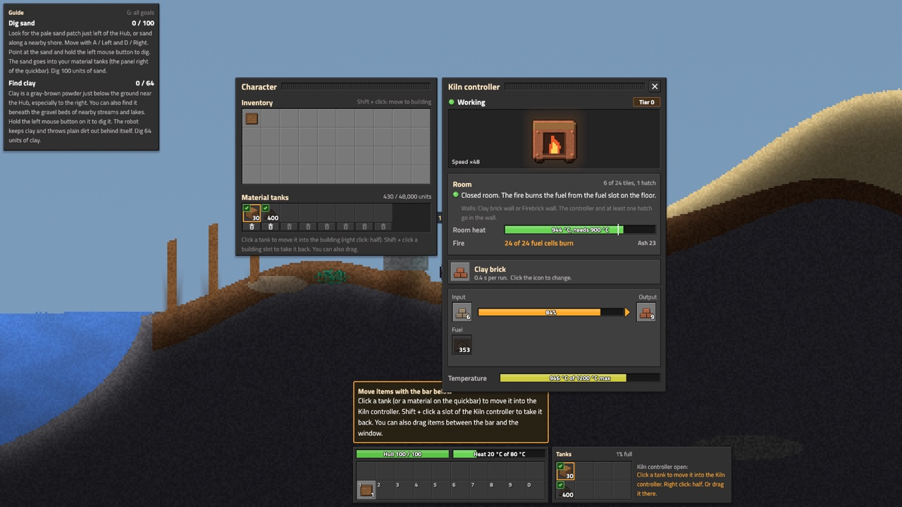
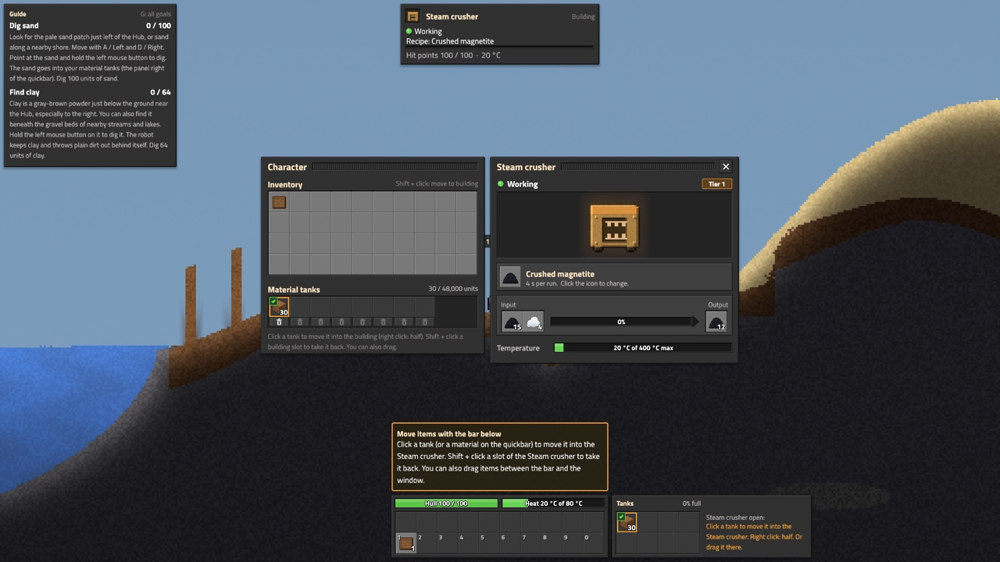
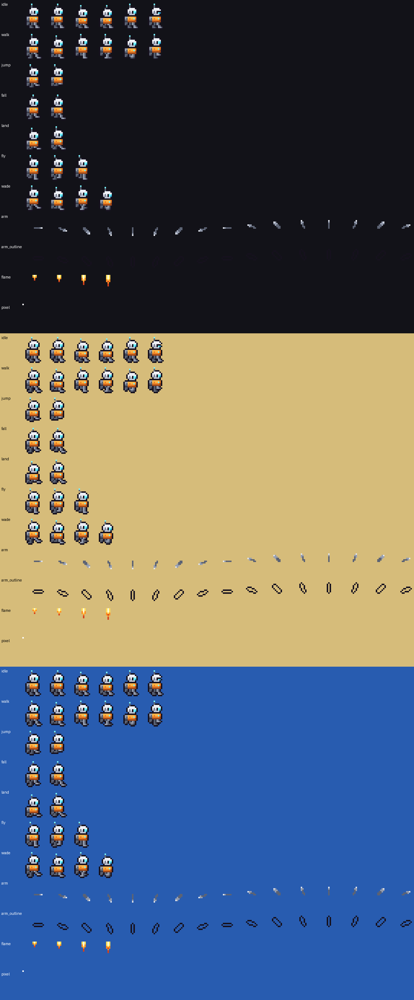

# Deep Foundry

A 2D side-view factory game in a world where every cell moves. Sand falls, water flows, fire burns and metal melts, as in Noita. On top of that you build a factory and work through a long production tree, as in Factorio and GregTech.

Written in Rust with wgpu and egui.



## Overview

You are a small robot at a broken Hub. You dig material into your tanks, craft your first tools and buildings, and repair the Hub stage by stage. Each tier opens new machines: fire and clay first, then bronze, then steam.

The machines work with the real cells of the world. A kiln is a room of brick walls with a real fire inside. The room temperature comes from the burning cells. Ore falls into a hopper, moves on a belt and is washed with real water.

## Features

- **Cell simulation**
  - Powders, liquids, gases and fire.
  - Heat flow, melting, boiling and freezing.
  - Reactions and burning.
  - Explosions.
  - Liquids that splash and settle flat.
  - Parallel chunk update. Chunks with no change sleep.
- **Endless world**
  - The world has no end to the left or right.
  - Chunks are made when you need them and dropped when you leave.
  - Saves keep only the chunks that changed.
  - A world generator makes the surface, biomes, trees, lakes, ore veins and caves.
- **The robot**
  - Walk, jump and fly with a jetpack.
  - Dig material into tanks.
  - Choose per material if the robot keeps it or drops it.
  - Spray material out.
  - Scan to discover materials.
- **Construction**
  - Place buildings as ghosts that show their ports.
  - Drag lines, rotate, copy (pipette), undo and redo.
  - Remove buildings by dragging.
  - A hover box shows what is under the mouse.
- **Factory**
  - Hand crafting and a workbench.
  - Crates, barrels, hoppers and belts.
  - Room machines: kiln, coke oven and blast furnace.
  - Crucible, bellows and casting molds.
  - Stamp mill and sluice.
  - Boiler, pipes and steam machines.
- **Progression**
  - Research in labs.
  - Hub repair stages and milestones.
  - Material discovery.
  - A guide that always shows the next goal.
- **Interface**
  - Factorio-style windows: character, crafting, buildings and research.
  - Pause, save and load menus.
- **Keys**
  - All keys can be changed in Settings.
  - By default, keys match by position on the keyboard, so movement also works on Dvorak and AZERTY.
- **Look**
  - Pixel-art robot with animations.
  - Light from hot and glowing cells.
  - Debug views for chunks, heat and the grid.

## Planned features

- Scripted play-through tests for smelting, so that the bronze and stamp mill goals can be checked.
- Factories that keep running when the player is far away.
- Blueprints, and ghosts that wait for items.
- Power networks and electric machines (Tier 2 and later).
- Deeper world layers, with more ores and hazards.
- Guide texts written for the generated world.
- Sound.

## Screenshots

| | |
|---|---|
|  |  |
| The start, with the guide | A kiln room that fires clay bricks |
|  |  |
| A steam crusher at work | The robot's animations |

## Run

You need Rust 1.98 or newer ([rustup.rs](https://rustup.rs)). The game is tested on macOS.

```
git clone <this repository>
cd deep-foundry
cargo run --release -p deep_foundry
```

Start a new game with the world generator in place of the demo world:

```
cargo run --release -p deep_foundry -- --world gen
```

Default keys (by key position; change them in Settings > Controls):

| Key | Action |
|---|---|
| A / D, or the arrow keys | Walk |
| W, Up or Space | Jump; hold to fly |
| Left mouse | Dig |
| Right mouse | Spray the chosen tank |
| E | Character and crafting |
| G | Guide |
| T | Research |
| F | Scan |
| R | Rotate |
| Q | Copy the building under the mouse |
| Ctrl+Z / Ctrl+Y | Undo / redo |
| F3 | Debug window |
| F4 / F5 / F6 | Debug views: chunks, heat, grid |

Tests:

```
cargo test --workspace --release
cargo run --release -p foundry_headless -- test
```

More options (screenshots, benchmarks, test scenes) are in [crates/game/README.md](crates/game/README.md) and [crates/headless/README.md](crates/headless/README.md). The design documents are in [docs/design](docs/design/README.md).
